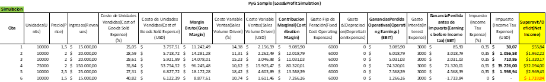
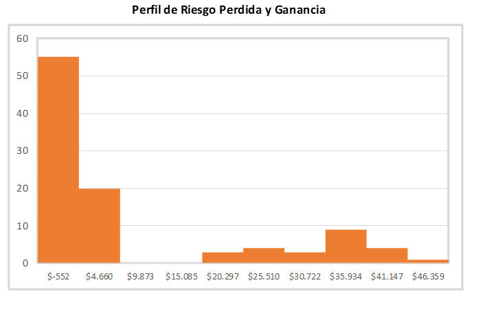

###L&P sample using Montecarlo Method

Case study: Using the Monte Carlo method in Excel:
By using simulation and probabilities, the aim is to obtain a decision-making tool to help the manager to make decisions, despite the level of uncertainty in the different variables. In the case of this example, the goal is to estimate and simulate a profit and loss statement by knowing some distributions such as:
1.	Unit sales 75,000 (30%) or 10,000 (70%). The average price follows the following distribution: 
a.	1.5 usd - 25%
b.	2 usd - 50%
c.	2.5 usd - 25%
2.	The cost of units sold follows the following distribution:
a.	Normal distribution with a mean of 30 and a standard deviation of 5
3.	The variable operating cost follows the following distribution:
a.	Uniform distribution from 10% to 20%
4.	Fixed operating costs of 6,000
5.	Interest expenses : 3,000
6.	Taxes: if EBIT - interest < 20,000, a rate of 35% is applied; otherwise, the rate is 55%.

The solution file for this case includes a sheet with the table of contents, one for parameter settings, the simulation of the profit and loss statement, and finally the risk profile
Table of Contents:
Here we find the Index of the worksheet.

Parameters:
This sheet shows the settings of the variables with the defined distribution. It will be useful for modifying or changing them in order to evaluate different scenarios.
 

Simulation of the Profit and Loss Statement

This sheet contains the simulation of the profit and loss statement (n=100), with each record generated from random numbers and the distributions defined in the configuration section. The result will be used to create a histogram and define the risk profile of this case.

Simulation of the Profit and Loss Statement

 
Summary of the Main Statistics

 
It can be observed that the average is around 11,000 USD with a high standard deviation (15,000 USD), confirmed by the coefficient of variation of 142%, indicating a high dispersion of the data obtained.
Risk Profile
Below is the snapshot when capturing the surplus/deficit histogram, allowing to determine the probability of the business being profitable or not. Two distinct groups are observed, due to the range of unit sales shown in the case. However, 80% of the cases result in a profitable operation
 
 

Conclusion:
The use of the Monte Carlo method provides us with a straightforward way to obtain a tool for modeling and analyzing complex and stochastic systems. Traditional analytical methods can lead to erroneous decisions or provide partial information in such scenarios. Monte Carlo simulation allows us to assess the impact of uncertainty and variability on results, facilitating the analysis of different scenarios and addressing uncertainties that managers may have, all without incurring in significant costs.

Source: Case taken from the book 'Excel Data Analysis – Modeling and Simulation' by Hector Guerrero.
